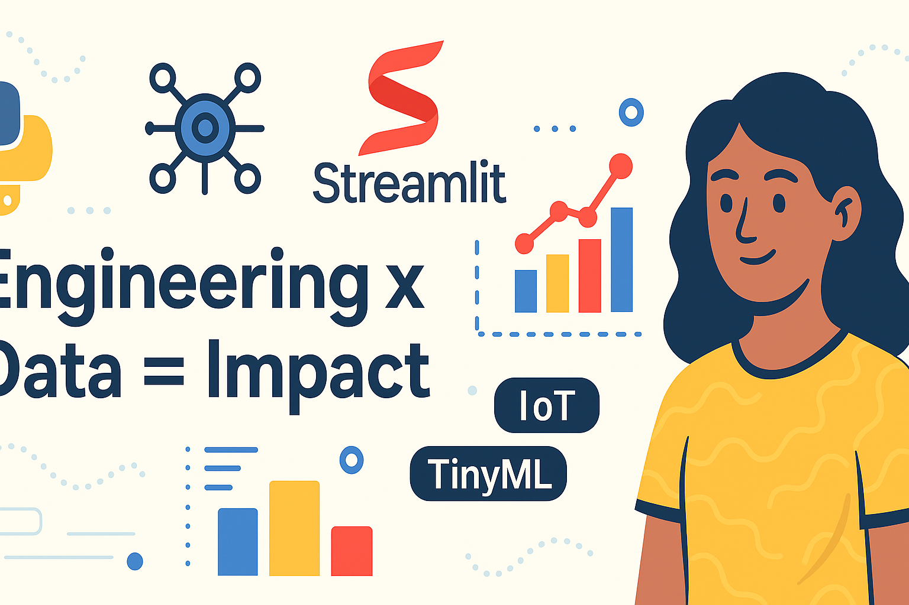

<h1 align="center">Hi, I'm Suhani 👋</h1>

  <em>Aspiring Embedded + Data Analytics Engineer</em> 
  <em>Turning sensors + code into smart, visual systems</em>

  

---

### ⚡ About Me

- 🎓 ECE @ SRM | Specialization in Data Science  
- 🧠 Learning by building real systems  
- 🛠️ Python • Streamlit • CSV • IoT Logic  
- 💬 Passionate about engineering x data x impact

---

### 📬 Reach Me At

  
  
📩 guptasuhani2407@gmail.com
